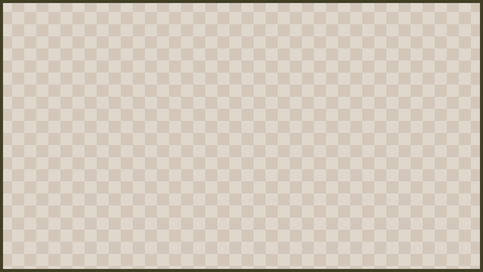

# Albums And Collections

Albums give players a map-based way to track configured photo collections. Run `/sb album` to receive or open an album map when your server has granted album access.

## Collections

Collections are sets of photo subjects defined by server admins. A collection can ask players to capture specific subjects such as mobs, places, biomes, dimensions, weather, time-of-day scenes, or selfies, depending on how the server has configured it.

When a player captures a matching subject, ShutterBug records progress for that collection. Albums update their display and lore to show the selected collection, progress, and current or available collection state.

## Album Progress

Album item lore can show:

- the selected collection
- progress through the current collection
- the current collection position
- available collection state
- controls for moving between collections
- a short collection description

## Cycling Collections

Albums can cycle between available collections. If a collection is empty or no collections are configured, ShutterBug should show a user-facing empty state instead of presenting progress that cannot be completed.

## Admin Notes

Admins define collections in `collections.yml`. Good collections are specific, achievable, and easy for players to understand from album text. After changing collections, use `/sb reload` if available and test with a non-admin player account to confirm progress and album display are clear.
