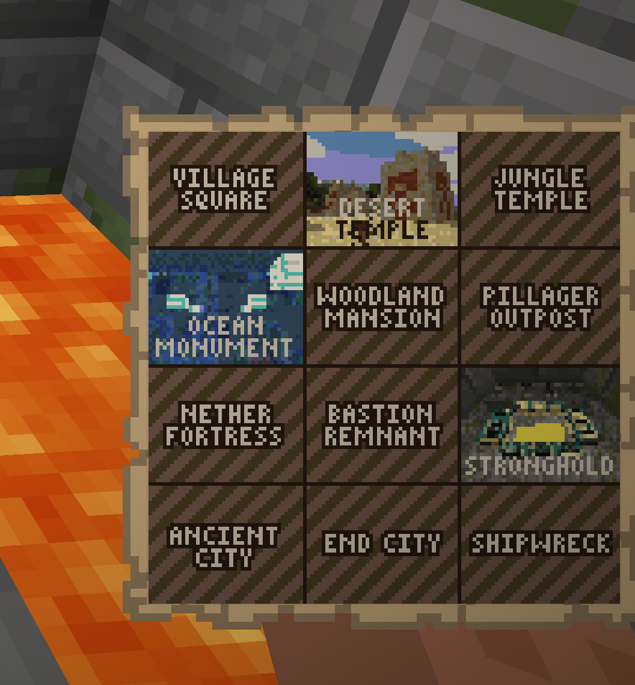
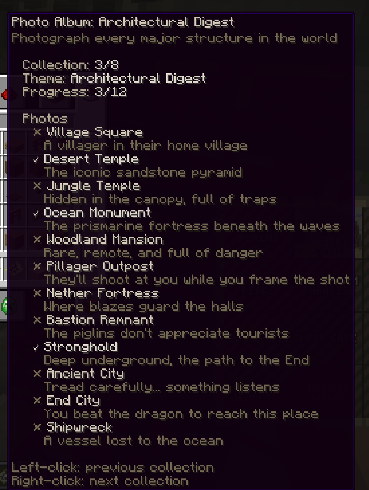
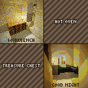
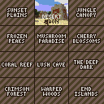
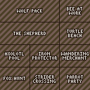
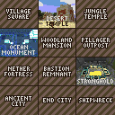
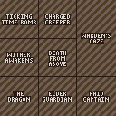
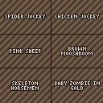
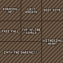
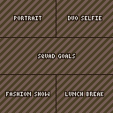

# Albums And Collections

Albums are map-based collection trackers. They show the selected collection, the current collection position, captured photo count, missing subjects, and a collage preview of the photos saved for that album.



## Getting An Album

By default, players craft a photo album with a glass pane, paper, and a book and quill in the center column. Some servers also allow `/sb album` as a convenience command.

Hold the album and use:

- Left-click to move to the previous collection.
- Right-click to move to the next collection.
- `/sb album refresh` to redraw the album in your hand.

## Reading Album Progress

Album lore shows the selected collection state:

- **Collection**: the current collection number, such as `3/8`.
- **Theme**: the selected collection name.
- **Progress**: captured subjects out of total subjects.
- **Photos**: a checklist of every subject in the selected collection.

Captured entries use a bright checkmark and brighter subject name. Missing entries use a muted cross. Each subject also includes a short hint for what to photograph.



Album maps show the selected collection as a collage. Missing subjects use labelled placeholder tiles. Captured subjects use the actual photo that completed that subject.

{ .sb-map }

## Exporting Album PNGs

Run `/sb album export` to write PNG copies of your album collections. ShutterBug saves each generated image as `album.png` beside the album subject files:

```text
plugins/ShutterBug/albums/<player-uuid>/<collection-id>/album.png
```

Use `/sb album export <collection>` to export one collection or `/sb album export all` to export every collection. Admins with album management access can run `/sb album export <player> [collection|all]` for an online player.

## Built-In Collection Guide

These are the default collections included with ShutterBug. Server owners can edit `collections.yml`, so your server may differ.

### Postcards

Capture the beauty of every landscape. Wish you were here.

{ .sb-map }

| Photo | Description | How to capture |
| --- | --- | --- |
| **Sunset Plains** | Golden hour over the grasslands. | take a photo in a plains biome during sunset. |
| **Desert Noon** | Blazing sun over endless dunes. | take a photo in a desert biome during daytime. |
| **Jungle Canopy** | Dense tropical wilderness. | take a photo in a jungle biome. |
| **Frozen Peaks** | Breathtaking mountain views. | take a photo in a frozen peaks biome. |
| **Mushroom Paradise** | The rarest landscape in the world. | take a photo in a mushroom fields biome. |
| **Cherry Blossoms** | Pink petals drifting in the breeze. | take a photo in a cherry grove biome. |
| **Coral Reef** | Vibrant underwater colors. | take a photo in a warm ocean biome. |
| **Lush Cave** | An underground garden. | take a photo in a lush caves biome. |
| **The Deep Dark** | Silence. Sculk. Darkness. | take a photo in a deep dark biome. |
| **Crimson Forest** | An eerie red woodland of the Nether. | take a photo in a crimson forest biome. |
| **Warped Woods** | Alien blue forests of the underworld. | take a photo in a warped forest biome. |
| **End Islands** | The strange outer islands of the End. | take a photo in The End. |

### Wildlife Documentary

Observe nature - animals in their element.

{ .sb-map }

| Photo | Description | How to capture |
| --- | --- | --- |
| **Wolf Pack** | Three or more wolves running together. | get at least three wolves in the photo. |
| **Bee at Work** | A busy pollinator. | get a bee in the photo. |
| **The Shepherd** | A wolf and sheep - predator meets prey. | get a sheep and a wolf in the same photo. |
| **Turtle Beach** | A turtle on the shore. | get a turtle in the photo while in a beach biome. |
| **Axolotl Pool** | The cutest cave dwellers. | get an axolotl in the photo while in a lush caves biome. |
| **Iron Protector** | A golem standing guard over its village. | get an iron golem and a villager in the same photo. |
| **Wandering Merchant** | The trader and both his llamas. | get a wandering trader and at least two trader llamas in the photo. |
| **Fox Hunt** | A fox eyeing its next meal. | get a fox and a chicken in the same photo. |
| **Strider Crossing** | Lava-walking across the Nether. | get a strider in the photo while in the Nether. |
| **Parrot Party** | Two or more parrots together. | get at least two parrots in the photo. |

### Architectural Digest

Photograph every major structure in the world.

{ .sb-map }

| Photo | Description | How to capture |
| --- | --- | --- |
| **Village Square** | A villager in their home village. | photograph a villager while the frame includes a village structure. |
| **Desert Temple** | The iconic sandstone pyramid. | take a photo while the frame includes a desert pyramid. |
| **Jungle Temple** | Hidden in the canopy, full of traps. | take a photo while the frame includes a jungle pyramid. |
| **Ocean Monument** | The prismarine fortress beneath the waves. | take a photo while the frame includes an ocean monument. |
| **Woodland Mansion** | Rare, remote, and full of danger. | take a photo while the frame includes a woodland mansion. |
| **Pillager Outpost** | They'll shoot at you while you frame the shot. | take a photo while the frame includes a pillager outpost. |
| **Nether Fortress** | Where blazes guard the halls. | take a photo while the frame includes a Nether fortress. |
| **Bastion Remnant** | The piglins don't appreciate tourists. | take a photo while the frame includes a bastion remnant. |
| **Stronghold** | Deep underground, the path to the End. | take a photo while the frame includes a stronghold. |
| **Ancient City** | Tread carefully... something listens. | take a photo while the frame includes an ancient city. |
| **End City** | You beat the dragon to reach this place. | take a photo while the frame includes an End city. |
| **Shipwreck** | A vessel lost to the ocean. | take a photo while the frame includes a shipwreck. |

### Tricky Situations

Every shot here has a story.

{ .sb-map }

| Photo | Description | How to capture |
| --- | --- | --- |
| **Ticking Time Bomb** | Photograph ignited TNT - then run. | get primed TNT in the photo. |
| **Charged Creeper** | A creeper struck by lightning. Incredibly rare. | get a charged creeper in the photo. |
| **Warden's Gaze** | It knows you're there. It's angry. | get an angry warden in the photo. |
| **Wither Awakens** | Capture the moment of creation - and destruction. | photograph the Wither while it is spawning. |
| **Death From Above** | A falling anvil - timing is everything. | get a falling anvil in the photo. |
| **Raid Captain** | The patrol leader with the ominous banner. | get a raid captain in the photo. |

### Rare Encounters

Things most players have heard of but never witnessed.

{ .sb-map }

| Photo | Description | How to capture |
| --- | --- | --- |
| **Spider Jockey** | A skeleton riding a spider - 1% spawn chance. | get a skeleton riding a spider in the photo. |
| **Chicken Jockey!!** | chicken jokey!!!! | get a zombie riding a chicken in the photo. |
| **Pink Sheep** | 1 in 512 natural sheep are pink. | get a pink sheep in the photo. |
| **Brown Mooshroom** | A mooshroom struck by lightning - incredibly rare. | get a brown mooshroom in the photo. |
| **Skeleton Horsemen** | The eerie skeleton trap horse, triggered by lightning. | get a skeleton riding a skeleton horse in the photo. |
| **Baby Zombie in Gold** | The tiny terror in full golden armor. | get a baby zombie wearing golden armor in the photo. |
| **Invisible Mob** | Where did it go? Oh, there it is. | get an invisible mob in the photo. |
| **Cows and Cows** | Mushroom, Brown Mooshroom, Cow, and Baby Cow. | get a mooshroom, a cow, a brown mooshroom, and a baby cow in the photo. |
| **The Crossing** | Fox, Chicken, Seeds, and a Boat. A classic puzzle. | get a fox and chicken in the photo while wheat seeds are detected nearby. |
| **Herobrine** | He is real. | photograph a Herobrine shrine. |

### Extreme Selfies

All require selfie mode. You are the story.

{ .sb-map }

| Photo | Description | How to capture |
| --- | --- | --- |
| **Burning Up** | Selfie while on fire. | take a selfie while you are on fire. |
| **Last Breath** | Selfie with 3 or fewer hearts. | take a selfie while you are at low health. |
| **Deep Dive** | Selfie while fully submerged. | take a selfie while underwater. |
| **Free Fall** | Selfie while plummeting. | take a selfie while falling. |
| **Top of the World** | Selfie above the clouds. | take a selfie above Y=200. |
| **Withering Away** | Selfie while suffering the Wither effect. | take a selfie while you have the Wither effect. |
| **Into the Darkness** | Selfie in total darkness - a warden is near. | take a selfie while you have the Darkness effect. |

### Social Butterfly

Photography is better with friends.

{ .sb-map }

| Photo | Description | How to capture |
| --- | --- | --- |
| **Portrait** | Photograph another player. | get at least one other player in the photo. |
| **Duo Selfie** | Selfie with a friend. | take a selfie with at least one other player in the frame. |
| **Squad Goals** | Four or more players in one photo. | get at least four players in one photo. |
| **Fashion Show** | Photograph someone in full netherite armor. | get a player wearing full netherite armor in the photo. |
| **Lunch Break** | Photograph a player eating. | get a player eating in the photo. |

### Home Sweet Home

The simple comforts of a Minecraft home.

{ .sb-map }

| Photo | Description | How to capture |
| --- | --- | --- |
| **Workbench** | Where it all begins. | get a crafting table in the photo. |
| **Hot Oven** | A furnace hard at work. | get a lit furnace in the photo. |
| **Treasure Chest** | A chest full of possibilities. | get a chest or trapped chest in the photo. |
| **Good Night** | Time to rest. | get any bed color in the photo. |

### Undead Mobs

Take a picture of every undead mob.

| Photo | Description | How to capture |
| --- | --- | --- |
| **Zombie** | The classic undead. | get a zombie in the photo. |
| **Skeleton** | A rattling archer. | get a skeleton in the photo. |
| **Phantom** | Sleep deprivation. | get a phantom in the photo. |
| **Drowned** | The ocean's undead. | get a drowned in the photo. |
| **Husk** | The desert's undead. | get a husk in the photo. |
| **Stray** | The frozen undead. | get a stray in the photo. |
| **Wither Skeleton** | Tall, dark, and deadly. | get a wither skeleton in the photo. |
| **Zombified Piglin** | Neutral until provoked. | get a zombified piglin in the photo. |
| **Zoglin** | An aggressive undead beast. | get a zoglin in the photo. |

## Admin Notes

Admins define collections in `collections.yml`. Good collections are specific, achievable, and easy for players to understand from album text. After changing collections, use `/sb reload` if available and `/sb album refresh` while holding an album to update its display.

Useful admin commands include `/sb album give [player]`, `/sb album status [player] [collection]`, `/sb album reset <player> [collection|all]`, and `/sb album export [player] [collection|all]`.
