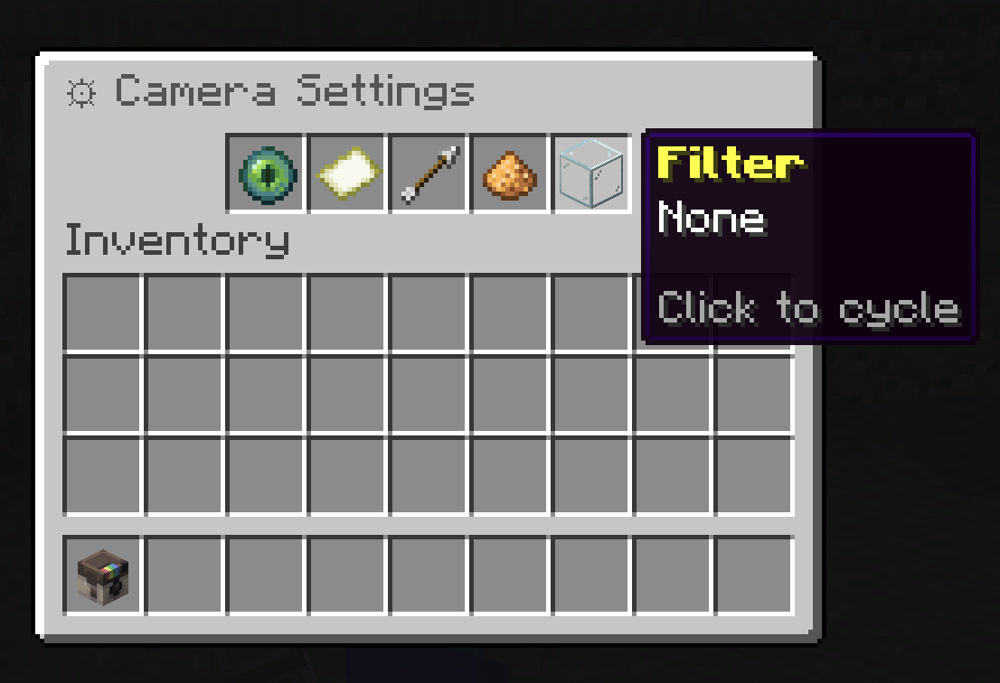
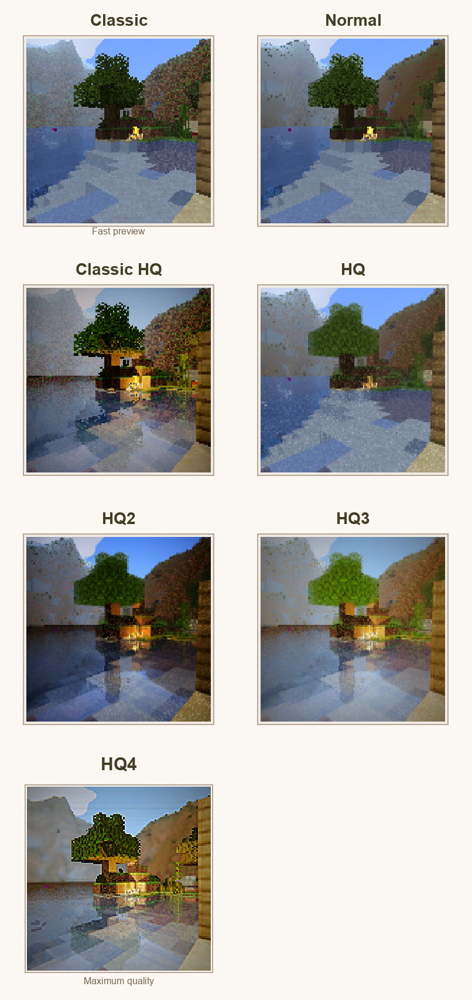
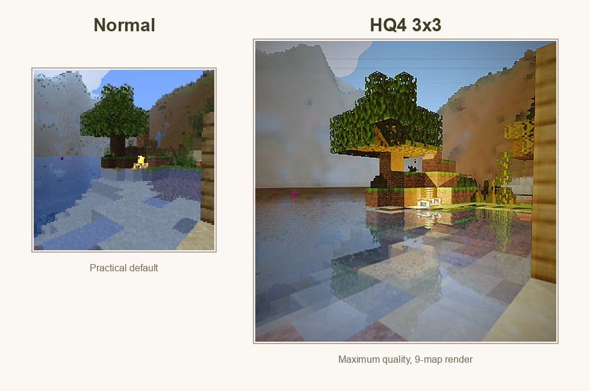
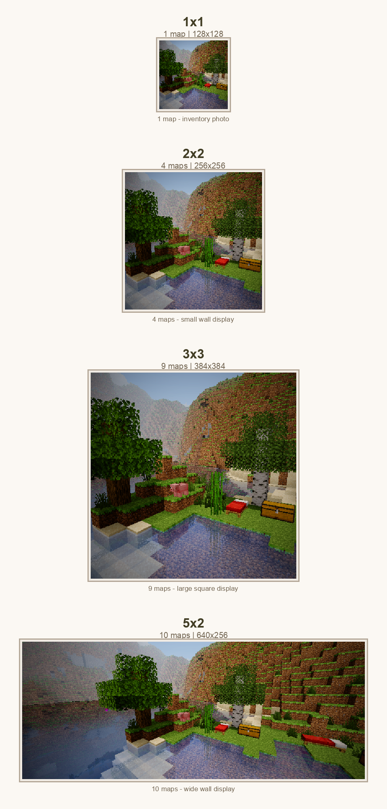
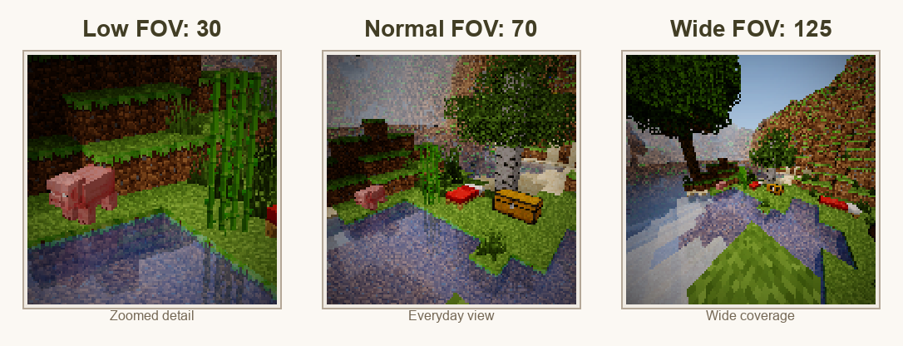
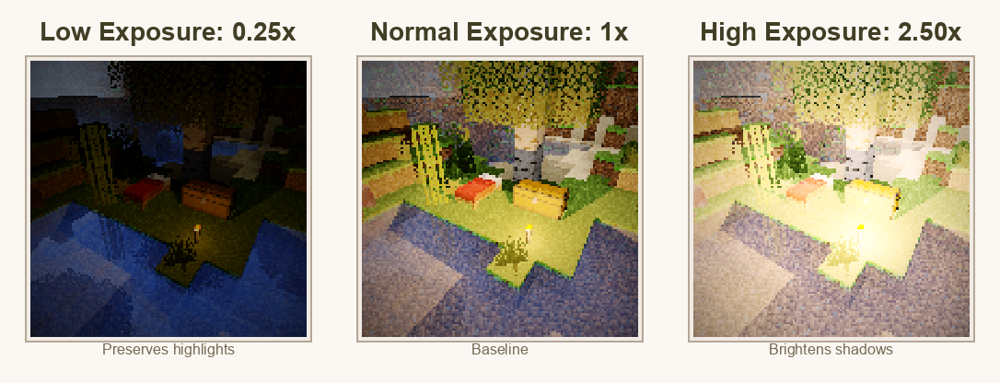
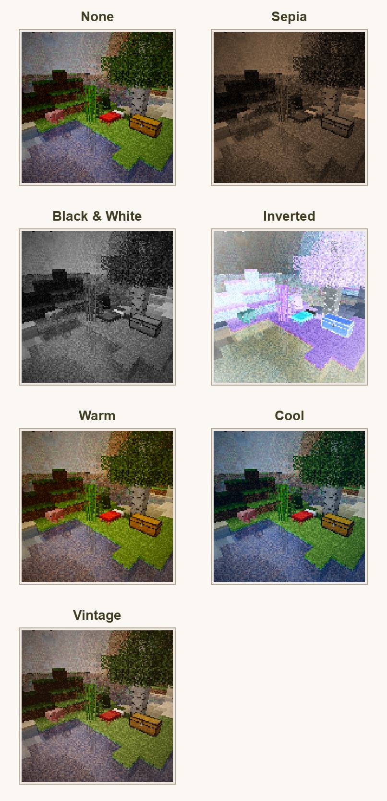
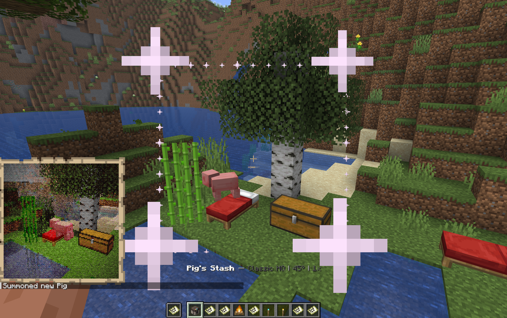

# Camera Settings

<figure class="sb-figure">
  
  <figcaption>The settings menu controls render profile, size, FOV, exposure, and filter before the next camera shot.</figcaption>
</figure>

Use `/sb settings` to tune the next photo before you take it. Settings are per-player, so changing your camera does not change another player's camera.

  <strong>Photo values are stored in exported PNG metadata.</strong> The comparison labels below use the mode, FOV, exposure, filter, photo size, tile count, and image size written by ShutterBug.

## How To Use The Menu

| Slot | Setting | How To Change It |
| --- | --- | --- |
| Mode | Render profile | Click to cycle. HQ profiles require permission. |
| Size | Photo dimensions | Click to cycle through available map sizes. |
| FOV | Field of view | Left-click to lower by 5, right-click to raise by 5. |
| Exposure | Brightness multiplier | Left-click to lower by 0.25, right-click to raise by 0.25. |
| Filter | Color treatment | Click to cycle through available filters. |

## Render Profile

Render profile changes the raytracer used for the shot. Lower profiles are faster and more direct. Higher profiles add more atmosphere, lighting, water treatment, and post-processing.

<figure class="sb-figure">
  
  <figcaption>All render profiles photographed from the same locked scene. Labels are taken from PNG metadata.</figcaption>
</figure>

| Mode | Best For | Notes |
| --- | --- | --- |
| Classic | Fast collection photos and quick previews. | Crisp, simple, closest to the original map look. |
| Normal | Everyday photography. | Balanced quality and speed. |
| Classic HQ | Higher quality classic-style captures. | Requires HQ/cinematic permission. |
| HQ | Showcase shots. | Better lighting and atmosphere. |
| HQ2 | Scenes with water, reflections, or richer lighting. | Requires HQ/cinematic permission. |
| HQ3 | High-end color and tone treatment. | Requires HQ/cinematic permission. |
| HQ4 | Final showcase images. | Maximum quality and longest render time. |

<figure class="sb-figure">
  
  <figcaption>Normal is the practical default. HQ4 is for final shots where render time matters less than image quality.</figcaption>
</figure>

## Photo Size

Size controls how many Minecraft map items make up the photo. A single-map photo is easy to carry and use for collection progress. Larger sizes create more detail and are better for walls, galleries, and server showcases.

<figure class="sb-figure">
  
  <figcaption>Photo size metadata shows map count and pixel dimensions: 1x1, 2x2, 3x3, and 5x2.</figcaption>
</figure>

| Size | Maps | Best For |
| --- | ---: | --- |
| 1x1 | 1 | Inventory photos, collection captures, quick sharing. |
| 2x2 | 4 | Small wall displays with clearer detail. |
| 3x3 | 9 | Large square displays and build documentation. |
| 5x2 | 10 | Wide landscapes, banners, and panoramic wall displays. |

Paper cost, when enabled, scales with the number of map tiles.

### HQ4 Detail At Larger Sizes

HQ4 changes the render quality. Photo size changes how much room the render has to show that detail. A 1x1 HQ4 photo is still a single 128x128 map, while a 3x3 HQ4 photo gives the same kind of render nine maps of space.

  <figure class="sb-size-detail-card sb-size-detail-one">
    
1x1 HQ4

    
    <figcaption>1 map, 128x128. Good for albums, inventory photos, and quick sharing.</figcaption>
  </figure>
  <figure class="sb-size-detail-card sb-size-detail-three">
    
3x3 HQ4

    
    <figcaption>9 maps, 384x384. Better for wall displays where reflections, lighting, and small blocks need room to read.</figcaption>
  </figure>

## FOV

FOV means field of view. It controls how much of the world fits into the frame. Lower FOV feels zoomed in. Higher FOV feels wider.

<figure class="sb-figure">
  
  <figcaption>The same area at FOV 30, FOV 70, and FOV 125, read directly from ShutterBug PNG metadata.</figcaption>
</figure>

Use low FOV for portraits, mobs, and distant details. Use normal FOV for most photos. Use high FOV for interiors, large builds, group shots, and landscapes. Very high FOV can stretch the edges, so use it when coverage matters more than natural perspective.

## Exposure

Exposure controls final brightness. The plugin clamps exposure between `0.25x` and `4.0x`.

<figure class="sb-figure">
  
  <figcaption>Low exposure preserves bright areas. Higher exposure makes shadows and dark scenes easier to read.</figcaption>
</figure>

Start near `1.0x`, then move up or down one step at a time. A small adjustment is usually enough.

## Filters

Filters apply a final color treatment after the photo is rendered. They do not change the world, only the map image.

<figure class="sb-figure">
  
  <figcaption>Every filter shown on the same scene with FOV 70 and exposure 1x.</figcaption>
</figure>

| Filter | Effect | Good For |
| --- | --- | --- |
| None | No final color effect. | Accurate documentation and normal photos. |
| Sepia | Warm old-photo tone. | Historical builds, cozy scenes, albums. |
| Black & White | Removes color. | Architecture, contrast, dramatic shots. |
| Inverted | Reverses colors. | Experimental or event images. |
| Warm | Warmer orange tone. | Sunsets, villages, interiors. |
| Cool | Cooler blue tone. | Snow, night, ocean, End scenes. |
| Vintage | Aged color treatment. | Postcards and collection-style photos. |

## Viewfinder

<figure class="sb-figure">
  
  <figcaption>The viewfinder helps frame the shot before spending paper or waiting for a render.</figcaption>
</figure>

Use the viewfinder to check whether the subject is in frame, whether the FOV is too tight or too wide, and whether a larger photo size will capture the full scene.

## Paper Cost

If `consume-paper` is enabled, ShutterBug consumes paper when photos are taken in survival-style play. The cost is based on server configuration and the number of map tiles in the photo.

<figure class="sb-figure">
  
  <figcaption>Servers can show the current paper cost in help or settings. Larger photos usually cost more paper.</figcaption>
</figure>

Typical behavior:

- Single-map photos cost less.
- Larger photos create more map tiles.
- Creative or spectator players may be exempt.
- `/sb help` can show current paper cost when it applies.

## Practical Presets

| Goal | Suggested Settings |
| --- | --- |
| Fast collection photo | Normal, 1x1, FOV 70, exposure 1.0x, no filter. |
| Player portrait | Normal or HQ, low FOV, exposure adjusted for face lighting. |
| Large build | Normal/HQ, larger size, FOV 80-100. |
| Dark cave | Normal/HQ, exposure 1.25x-2.0x, no filter or warm filter. |
| Showcase render | Highest mode you can use, size chosen for display, FOV tuned to scene. |
