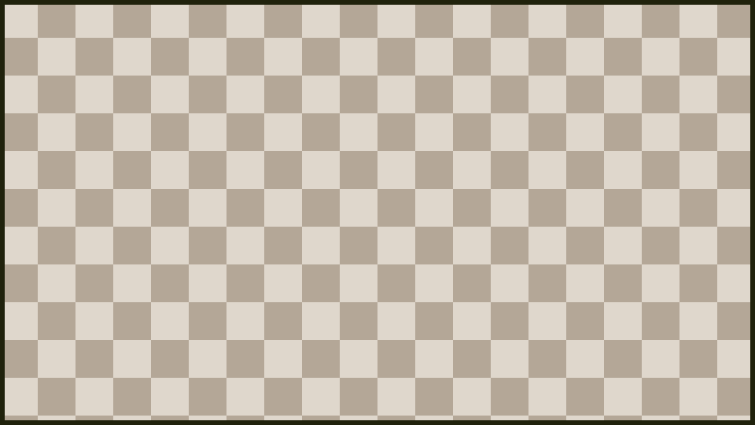
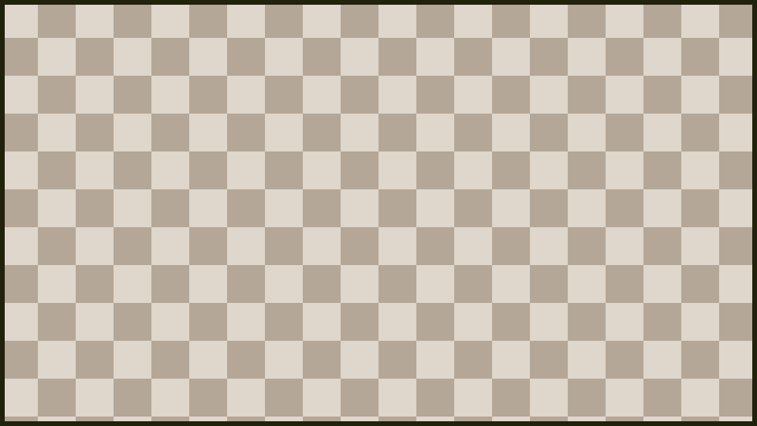
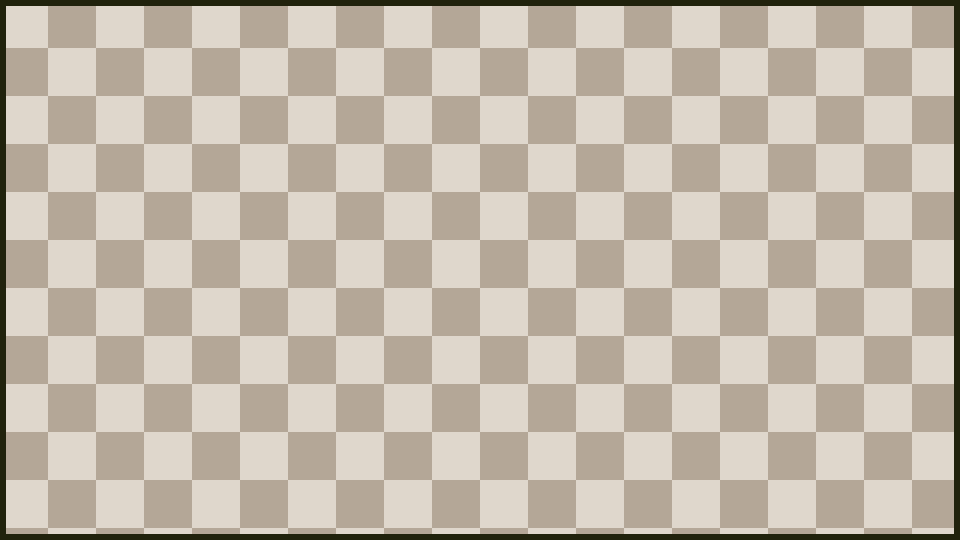
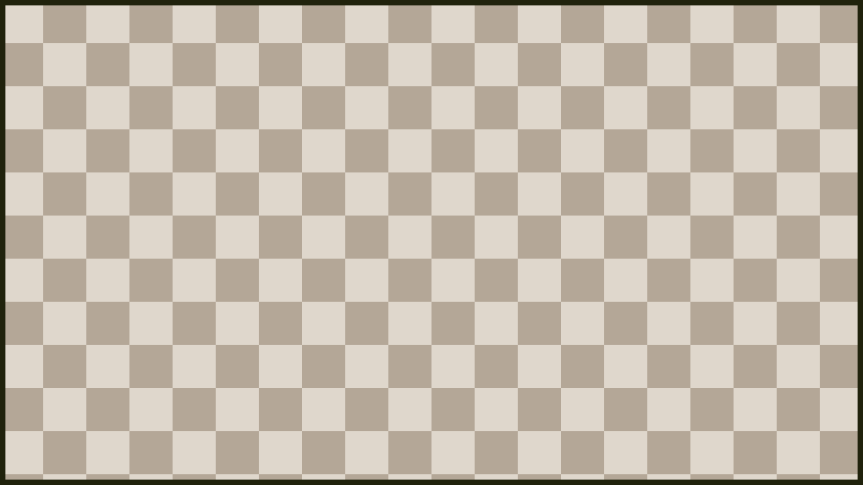
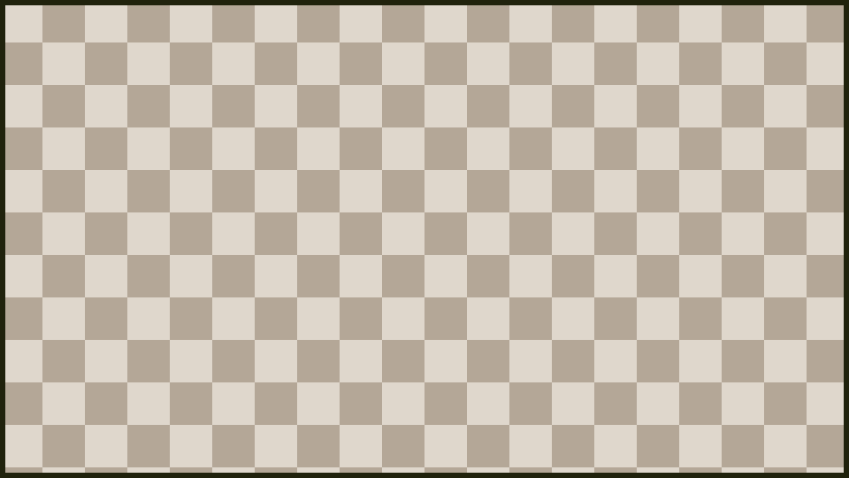
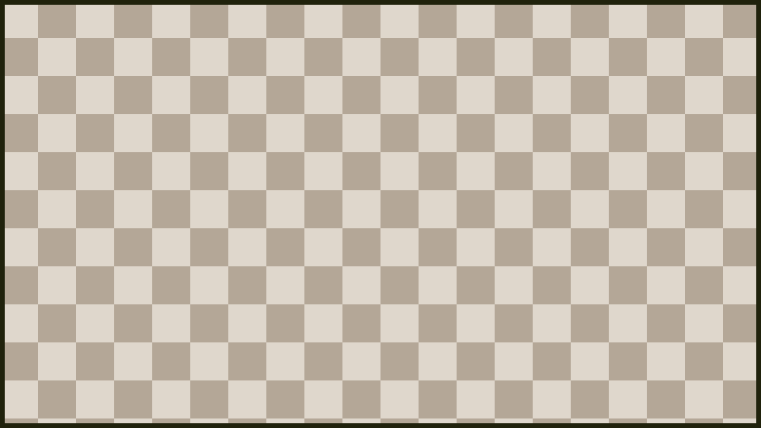
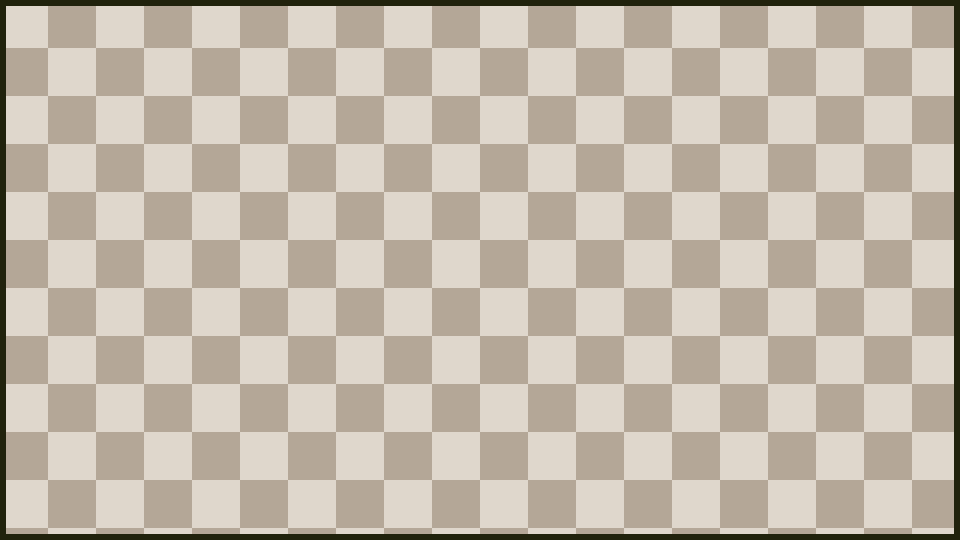

# Camera Settings

Use `/sb settings` to tune the next photo before you take it. The menu is built around five controls: mode, size, FOV, exposure, and filter. These settings are per-player, so changing your camera does not change another player's camera.

## How To Use The Menu

| Slot | Setting | How To Change It |
| --- | --- | --- |
| Mode | Render profile | Click to cycle. Cinematic/HQ profiles require permission. |
| Size | Photo dimensions | Click to cycle through available map sizes. |
| FOV | Field of view | Left-click to lower by 5 degrees, right-click to raise by 5 degrees. |
| Exposure | Brightness multiplier | Left-click to lower by 0.25, right-click to raise by 0.25. |
| Filter | Color treatment | Click to cycle through available filters. |

## Mode / Render Profile

Mode controls the renderer used for the shot. Higher modes can make showcase photos look better, but they can also take longer to render.

| Mode | Best For | Notes |
| --- | --- | --- |
| Classic | Fast shots and original-style map rendering. | Crisp, simple, closest to the original look. |
| Normal | Everyday photography. | Balanced quality and speed. |
| Classic HQ | Higher quality classic-style captures. | Requires cinematic permission. |
| HQ | Showcase shots with smoother rendering. | Requires cinematic permission. |
| HQ2 | Scenes with more lighting and atmosphere. | Requires cinematic permission. |
| HQ3 | High-end color and tone treatment. | Requires cinematic permission. |
| HQ4 | Maximum quality showcase photos. | Requires cinematic permission and may take the longest. |

When to use lower modes:

- Taking many photos quickly.
- Testing an angle before a final shot.
- Photographing simple scenes where extra quality is not noticeable.

When to use higher modes:

- Server showcase images.
- Album completion shots you want to keep.
- Builds with lighting, water, night scenes, or dramatic depth.

## Size

Size controls how many Minecraft map items make up the photo. A single-map photo is easy to carry and share. Larger sizes create a bigger image by splitting the photo across multiple map tiles.

Use smaller sizes when:

- You want a normal inventory item.
- You are taking quick collection photos.
- Paper consumption is enabled and you want to save materials.

Use larger sizes when:

- You want to display photos in item frames.
- You are documenting a large build.
- The server allows the extra map and paper cost.

## FOV

FOV means field of view. It controls how much of the world fits into the frame.

The plugin clamps FOV between `10` and `170` degrees. In the settings menu, left-click lowers FOV by 5 degrees and right-click raises it by 5 degrees. You may also see `/sb <fov>` or `/sb exposure:<amount>` style command use depending on your permissions.

Low FOV, such as `30` to `50`, feels zoomed in. It is useful for:

- Portraits.
- A single mob or player.
- Distant details.
- Cropping out distracting background.

High FOV, such as `90` to `120`, feels wide. It is useful for:

- Interiors where you cannot step back.
- Large builds.
- Group shots.
- Landscapes.

Very high FOV can stretch the edges of the image. Use it when the extra width matters more than natural perspective.

## Exposure

Exposure controls final brightness. The plugin clamps exposure between `0.25x` and `4.0x`. In the settings menu, left-click lowers exposure by `0.25` and right-click raises it by `0.25`.

Lower exposure is useful when:

- The sky is washing out the scene.
- Lava, glowstone, torches, or bright blocks are too strong.
- You want a moodier night photo.

Higher exposure is useful when:

- The scene is too dark.
- Subjects are in shadow.
- Caves, forests, or night scenes need more readable detail.

A small adjustment is usually enough. Start near `1.0x`, then move up or down one step at a time.

## Filters

Filters apply a final color treatment after the photo is rendered. They do not change the world, only the map image.

| Filter | Effect | Good For |
| --- | --- | --- |
| None | No final color effect. | Accurate documentation and normal photos. |
| Sepia | Warm old-photo tone. | Historical builds, cozy scenes, albums. |
| Black & White | Removes color. | Architecture, contrast, dramatic shots. |
| Inverted | Reverses colors. | Experimental or event images. |
| Warm | Warmer orange tone. | Sunsets, villages, interiors. |
| Cool | Cooler blue tone. | Snow, night, ocean, End scenes. |
| Vintage | Aged color treatment. | Postcards and collection-style photos. |

## Viewfinder

The camera item can show a viewfinder preview while you aim. The viewfinder helps you frame the shot before spending paper or waiting for a render.

Use the viewfinder to check:

- Whether the subject is in frame.
- Whether a large photo size will capture the full scene.
- Whether the FOV is too tight or too wide.
- Whether you need to step forward, step back, or change angle.

## Paper Cost

If `consume-paper` is enabled, ShutterBug consumes paper when photos are taken in survival-style play. The cost is based on server configuration and the number of map tiles in the photo.

Typical behavior:

- Single-map photos cost less.
- Larger photos can cost more because they create more map tiles.
- Creative or spectator players may be exempt depending on server behavior.
- `/sb help` can show the current paper cost when it applies to you.

## Practical Presets

| Goal | Suggested Settings |
| --- | --- |
| Fast collection photo | Normal, single map, FOV 70, exposure 1.0x, no filter. |
| Player portrait | Normal or HQ, low FOV, exposure adjusted for face lighting. |
| Large build | Normal/HQ, larger size, FOV 80-100. |
| Dark cave | Normal/HQ, exposure 1.25x-2.0x, no filter or warm filter. |
| Showcase render | Highest mode you can use, size chosen for display, FOV tuned to scene. |
