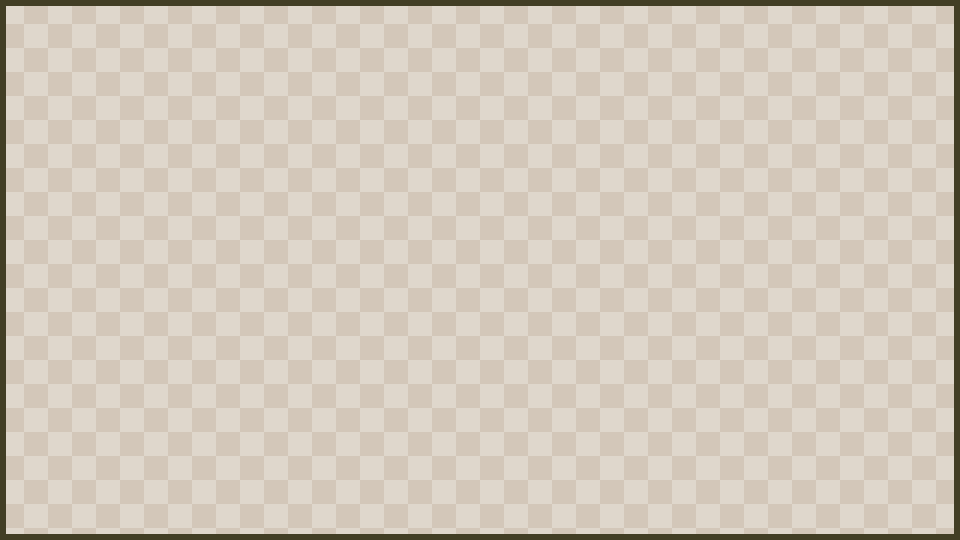

# Getting Started

ShutterBug uses the `/sb` command, with `/shutterbug` as an alias. Most servers will give players access through their permissions plugin and then provide cameras through a server-specific method such as a kit, shop, crafting recipe, admin command, or event reward.

## Server Setup

Admins should install the plugin, start the server once to generate configuration files, review `config.yml`, define any photo collections in `collections.yml`, and assign permissions before inviting players to use ShutterBug.

At minimum, players need access to the base `/sb` command and normal camera use. See [Permissions](permissions.md) for the available permission nodes.

## First Steps For Players

1. Ask a server admin how cameras are distributed on your server.
2. Run `/sb help` to see the commands currently available to you.
3. Open `/sb settings` to review your camera mode, size, FOV, exposure, and filter settings.
4. Take a photo using the camera item or an available `/sb` photo command.
5. Run `/sb album` to receive or open an album map for configured collections.

## Personalized Help And Completion

`/sb help` only shows commands available to the current player based on permissions and enabled state. If a server has not granted a command, or if a feature is not enabled for you, it should not clutter your help output.

Tab completion follows the same permission-aware command list. When you press Tab after `/sb`, suggestions are filtered to commands you can use.

For a longer guide, server owners can set `guide-url` so in-game help points to `{GITBOOK_URL}`.
