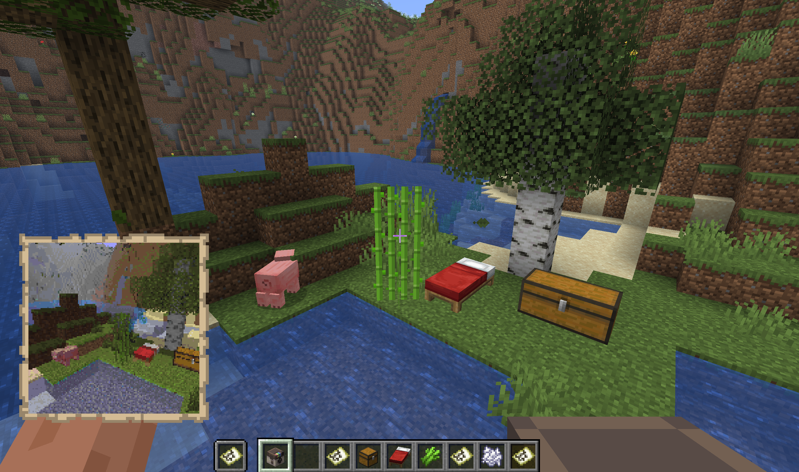

# Bắt đầu

Thử bắt đầu với một chiếc máy ảnh. Trên hầu hết máy chủ, người chơi có thể tự chế tạo máy ảnh, nhận từ bộ vật phẩm hoặc cửa hàng, hoặc được quản trị viên cấp trong các sự kiện. Nếu tính năng chế tạo được bật, công thức mặc định là:

| Hàng | Vật phẩm |
| --- | --- |
| Trên | Tấm kính vanilla ở ô giữa |
| Giữa | Thỏi sắt, Đá đỏ, Thỏi sắt |
| Dưới | Giấy, Giấy, Giấy |

Quản trị viên có thể thay đổi hoặc tắt công thức này, vì vậy hãy làm theo cấu hình của máy chủ nếu công thức trong tài liệu khác với công thức đang có trong trò chơi.

## Bức ảnh đầu tiên

1. Chế tạo hoặc nhận một chiếc máy ảnh.
2. Cầm máy ảnh trong tay.
3. Dùng `/sb` để xem thẻ khởi động ngắn, hoặc `/sb help` để xem danh sách lệnh đầy đủ.
4. Nhấp chuột phải khi cầm máy ảnh, hoặc dùng `/sb settings`, rồi kiểm tra chế độ, kích thước, FOV, phơi sáng và bộ lọc hiện tại.
5. Nhấp chuột trái để hiện kính ngắm và căn khung hình.
6. Nhấn Shift và nhấp chuột phải để chụp ảnh, hoặc nhấn Shift và nhấp chuột trái để chụp ảnh tự sướng.
7. Mở vật phẩm bản đồ đã hoàn thành để xem bức ảnh.

`/sb help` sẽ hiển thị danh sách lệnh phù hợp với từng tài khoản. Lệnh này chỉ liệt kê những lệnh mà tài khoản của người chơi được phép sử dụng trên máy chủ hiện tại. Nếu người chơi không có quyền dùng chế độ điện ảnh, công cụ quản trị, nhập ảnh hoặc lệnh tải lại, các lệnh đó sẽ không xuất hiện trong danh sách trợ giúp.

## Mở cài đặt máy ảnh

Sử dụng `/sb settings` trước khi chụp những cảnh quan trọng, hoặc nhấp chuột phải khi đang cầm máy ảnh. Menu cài đặt cho phép điều chỉnh cách bức ảnh tiếp theo được kết xuất. Các tùy chọn chính gồm:

| Cài đặt | Thay đổi điều gì |
| --- | --- |
| Mode | Chế độ kết xuất, quyết định chất lượng và phong cách hình ảnh. |
| Size | Kích thước ảnh, quyết định số ô bản đồ được sử dụng. |
| FOV | Góc nhìn của máy ảnh, quyết định khung hình rộng hay hẹp. |
| Exposure | Độ phơi sáng, quyết định ảnh cuối cùng sáng hay tối đến mức nào. |
| Filter | Bộ lọc màu, tạo hiệu ứng màu sắc cho ảnh sau khi chụp. |

Xem ví dụ chi tiết tại [Cài đặt máy ảnh](camera-settings.md).

## Album

Chế tạo Album ảnh bằng một tấm kính, giấy và một cuốn sách bút lông ở cột giữa:

| Hàng | Vật phẩm |
| --- | --- |
| Trên | Tấm kính ở ô giữa |
| Giữa | Giấy ở ô giữa |
| Dưới | Sách và bút lông ở ô giữa |

Máy chủ cũng có thể cho phép sử dụng `/sb album` để mở album nhanh. Album hiển thị bộ sưu tập đang chọn, các chủ đề đã hoàn thành, cách chụp những chủ đề còn thiếu và ảnh ghép từ các bức ảnh đã hoàn thành. Nhấp chuột trái hoặc phải vào album để chuyển qua các bộ sưu tập có sẵn.

## Nếu có gì khác biệt

Máy chủ có thể tùy chỉnh công thức, quyền sử dụng, lượng giấy cần cho mỗi bức ảnh, chế độ kết xuất mặc định và các bộ sưu tập. Nếu nội dung trong hướng dẫn này khác với những gì đang có trên máy chủ, hãy ưu tiên thông tin từ `/sb help`, `/sb settings` trong trò chơi và hướng dẫn của quản trị viên máy chủ.

Để có hướng dẫn dài hơn, dùng `/sb wiki`. Chủ máy chủ có thể đặt `guide-url` để trợ giúp trong trò chơi và `/sb wiki` trỏ tới `{GITBOOK_URL}`.
